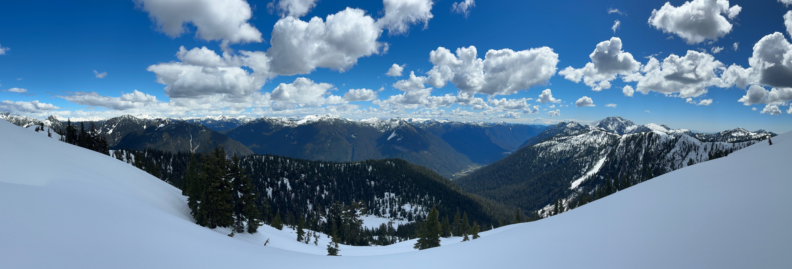

# Water Supply Areas Climate Summary - 2024



```{admonition} **Updated on:**
January 25, 2025
```

This web page is a supplement to Metro Vancouver's annual *Water Supply Areas - Climate Summary* report. It provides a series of plots, maps, and images summarizing the weather conditions in Metro Vancouver's water supply areas in 2024. This is your opportunity to dig deeper into the data, and to see how this year stacked up against recent years and historical normals.   

### Credits

This resource is created by Peter Marshall (Contact: [Peter.Marshall@metrovancouver.org](mailto:Peter.Marshall@metrovancouver.org)). Weather and climate data are primarily from a network of hydro-meteorological stations within the water supply areas. Additional data and plots from federal and provincial government agencies, research institutes, and US climate services are also included. If you have any questions or comments, please get in touch. 
